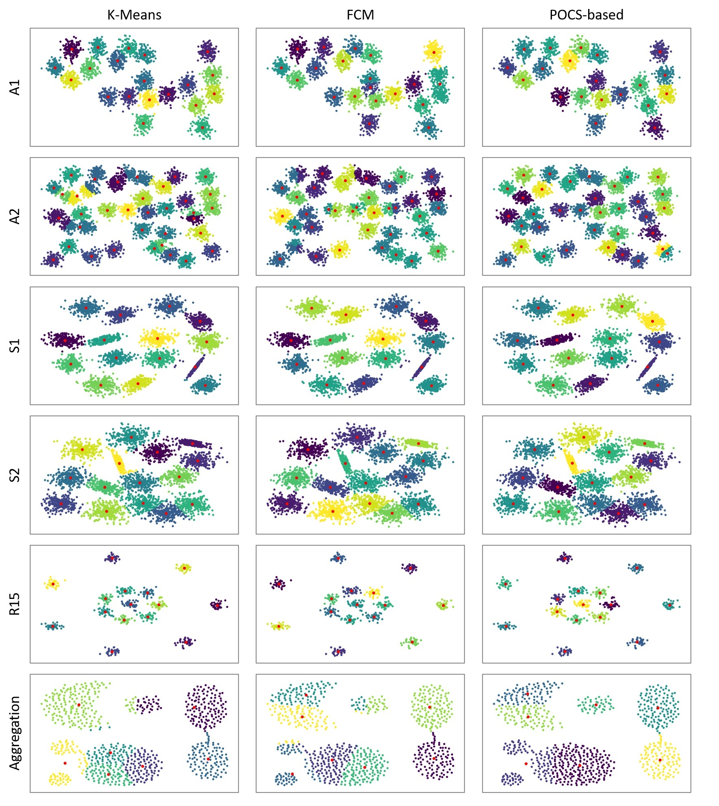

# POCS-based Clustering Algorithm 

Official Implementation of the POCS-based Clustering Algorithm, a Clustering Method based on Projection Onto Convex Set.

<!--- Authors: [Le-Anh Tran](https://scholar.google.com/citations?user=WzcUE5YAAAAJ&hl=en), Henock Mamo Deberneh, [Dong-Chul Park](https://ieeexplore.ieee.org/author/37275453300). --->

## I. Introduction

<!--- - Paper: [POCS-based Clustering Algorithm](https://ieeexplore.ieee.org/abstract/document/9920762) (in Proceedings of The International Workshop on Intelligent Systems 2022 (IWIS 2022), Ulsan, South Korea, August 17-19, 2022) --->

 - Authors: [Le-Anh Tran](https://scholar.google.com/citations?user=WzcUE5YAAAAJ&hl=en), Henock Mamo Deberneh, [Dong-Chul Park](https://ieeexplore.ieee.org/author/37275453300).
 - Blog: (will be available soon)

## II. Usage
1. Demo with Jupyter Notebook:

    Notebook: [pocs-based-clustering-demo.ipynb](https://github.com/tranleanh/pocs-based-clustering/blob/main/pocs-based-clustering-demo.ipynb)    
    
2. Installation

    ```
    pip install pocs-based-clustering
    ```
3. Test

    ```
    python test_pocs_based_clustering.py
    ```
## III. Results

Results on [Clustering basic benchmark](https://cs.joensuu.fi/sipu/datasets/)

<p align="center">

</p>


Have fun!

LA Tran

Created: 04.2022
