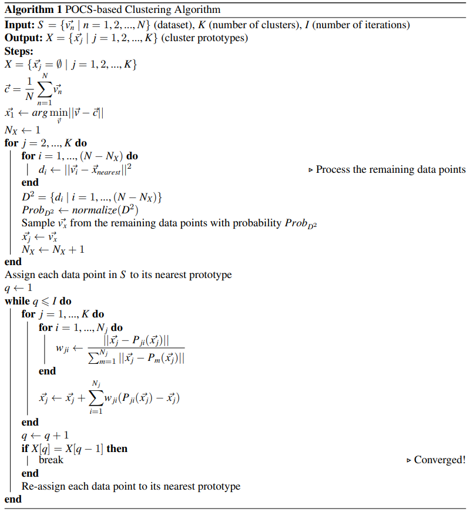

# POCS-based Clustering Algorithm 

Official implementation of the Projection Onto Convex Set (POCS)-based clustering algorithm.

## I. Introduction

<!--- - Paper: [POCS-based Clustering Algorithm](https://ieeexplore.ieee.org/abstract/document/9920762) (in Proceedings of The International Workshop on Intelligent Systems 2022 (IWIS 2022), Ulsan, South Korea, August 17-19, 2022) --->

 - Authors: [Le-Anh Tran](https://scholar.google.com/citations?user=WzcUE5YAAAAJ&hl=en), [Dong-Chul Park](https://scholar.google.com/citations?user=VZUH4sUAAAAJ&hl=en) *et al.*
 <!--- - Blog: [POCS-based Clustering Algorithm Explained (Medium)](https://tranlevision.medium.com/pocs-based-clustering-algorithm-explained-2f7d25183eff) --->
 - Algorithm:
     <p align="center">
     
     </p>

## II. Usage
1. Demo with Jupyter Notebook:

    Notebook: [pocs-based-clustering-demo.ipynb](https://github.com/tranleanh/pocs-based-clustering/blob/main/pocs-based-clustering-demo.ipynb)    
    
2. Installation

    ```
    pip install pocs-based-clustering
    ```
3. Test

    ```
    python test_pocs_based_clustering.py
    ```
## III. Results

Results on [Clustering basic benchmark](https://cs.joensuu.fi/sipu/datasets/)

<p align="center">

</p>


## Citation

Please cite our works if you utilize any data from this work for your study.

```bibtex
@inproceedings{tran2022pocs,
  title={POCS-based Clustering Algorithm},
  author={Tran, Le-Anh and Deberneh, Henock M and Do, Truong-Dong and Nguyen, Thanh-Dat and Le, My-Ha and Park, Dong-Chul},
  booktitle={2022 International Workshop on Intelligent Systems (IWIS)},
  pages={1--6},
  year={2022},
  organization={IEEE}
}

@article{tran2024cluster,
  title={Cluster Analysis via Projection onto Convex Sets},
  author={Tran, Le-Anh and Kwon, Daehyun and Deberneh, Henock Mamo and Park, Dong-Chul},
  journal={Intelligent Data Analysis},
  year={2024},
  publisher={IOS Press}
}
```

Have fun!

LA Tran

<!--- Created: 04.2022 --->
